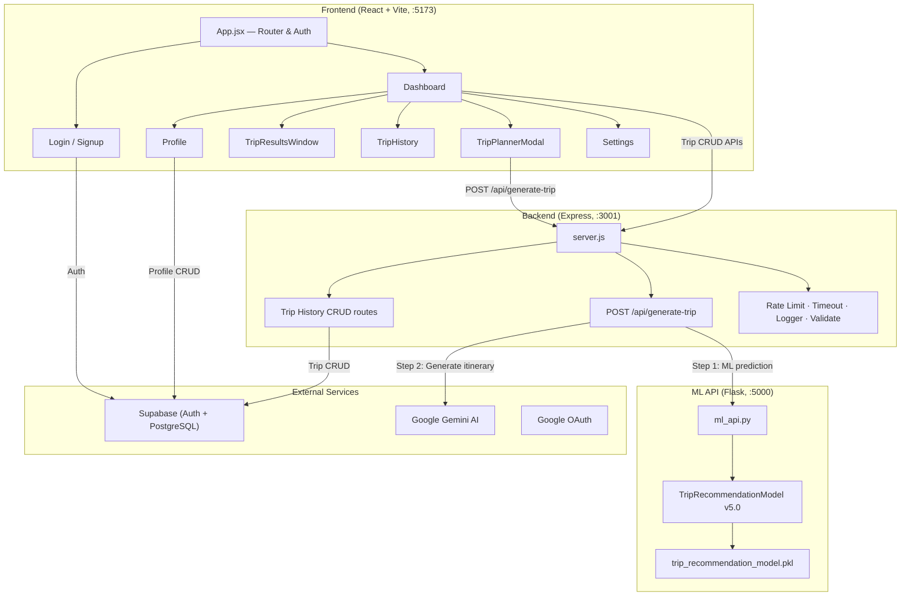

# AI Trip Planner — Full Project Walkthrough

> **Vignan University · Final Year Project · B.Tech CSE Data Science**
> A full-stack AI-powered travel itinerary planner with ML-based satisfaction predictions.

---

## Tech Stack Overview

| Layer | Technology | Purpose |
|-------|-----------|---------|
| **Frontend** | React 19 + Vite 7 | SPA with JSX components |
| **Styling** | Vanilla CSS (per-component) | Dark-themed, glassmorphism UI |
| **Backend** | Express.js (Node 20) | REST API on port 3001 |
| **ML API** | Flask (Python) | Satisfaction prediction on port 5000 |
| **AI Generation** | Google Gemini (`gemini-2.5-flash-lite`) | Day-by-day itinerary generation |
| **Auth & DB** | Supabase (PostgreSQL + Auth) | User auth, profiles, trip storage |
| **Auth Provider** | Google OAuth + Email/Password | Via Supabase Auth |

---

## Architecture Diagram



---

## Database Schema (Supabase)

### `profiles` table
| Column | Type | Notes |
|--------|------|-------|
| `id` | UUID (PK) | References `auth.users(id)` |
| `email` | VARCHAR(255) | |
| `first_name` | TEXT | |
| `last_name` | TEXT | |
| `avatar_url` | TEXT | |
| `avatar_color` | TEXT | Hex color for UI avatar |
| `default_budget` | TEXT | User preference |
| `default_companions` | TEXT | User preference |
| `created_at` | TIMESTAMPTZ | |
| `updated_at` | TIMESTAMPTZ | |

### `trips` table
| Column | Type | Notes |
|--------|------|-------|
| `id` | UUID (PK) | Auto-generated |
| `user_id` | UUID (FK) | References `auth.users(id)` |
| `destination` | TEXT | e.g. "Goa" |
| `duration` | TEXT | Number of days |
| `budget` | TEXT | cheap/moderate/luxury |
| `companions` | TEXT | single/couple/family/friends |
| `country` | TEXT | e.g. "India" |
| `trip_plan` | TEXT | Full AI-generated itinerary |
| `ml_prediction` | FLOAT | Satisfaction score 1–10 |
| `ml_recommendations` | JSONB | Hotels, restaurants, etc. |
| `is_favorite` | BOOLEAN | Default: false |
| `created_at` | TIMESTAMPTZ | |

> [!IMPORTANT]
> Row Level Security (RLS) is enabled on both tables — users can only access their own data.

---

## Frontend Components

### Routing ([App.jsx](file:///c:/Users/Dell/Downloads/Ai-Based%20Trip%20Planning/Aitrip/src/App.jsx))
- `/login` → Login (redirects to dashboard if authenticated)
- `/signup` → Signup
- `/dashboard` → Dashboard (protected)
- `/forgot-password` → ForgotPassword
- `/reset-password` → ResetPassword
- `/terms`, `/privacy` → TermsAndPrivacy
- `*` → Redirects based on auth state

### Component Breakdown

| Component | File | Purpose |
|-----------|------|---------|
| [Login](file:///c:/Users/Dell/Downloads/Ai-Based%20Trip%20Planning/Aitrip/src/components/Login.jsx) | `Login.jsx` (226 lines) | Email/password + Google OAuth login |
| [Signup](file:///c:/Users/Dell/Downloads/Ai-Based%20Trip%20Planning/Aitrip/src/components/Signup.jsx) | `Signup.jsx` (315 lines) | Registration with password strength indicator |
| [Dashboard](file:///c:/Users/Dell/Downloads/Ai-Based%20Trip%20Planning/Aitrip/src/components/Dashboard.jsx) | `Dashboard.jsx` (668 lines) | Main hub — stats, recent/favorite trips, quick actions |
| [TripPlannerModal](file:///c:/Users/Dell/Downloads/Ai-Based%20Trip%20Planning/Aitrip/src/components/TripPlannerModal.jsx) | `TripPlannerModal.jsx` (322 lines) | Trip input form with progress indicator |
| [TripResultsWindow](file:///c:/Users/Dell/Downloads/Ai-Based%20Trip%20Planning/Aitrip/src/components/TripResultsWindow.jsx) | `TripResultsWindow.jsx` (498 lines) | Day-by-day itinerary viewer with tabs (Itinerary/Recommendations/Tips) |
| [TripHistory](file:///c:/Users/Dell/Downloads/Ai-Based%20Trip%20Planning/Aitrip/src/components/TripHistory.jsx) | `TripHistory.jsx` (351 lines) | All past trips with search, filter, pagination |
| [Profile](file:///c:/Users/Dell/Downloads/Ai-Based%20Trip%20Planning/Aitrip/src/components/Profile.jsx) | `Profile.jsx` (184 lines) | Edit name, avatar color, email |
| [Settings](file:///c:/Users/Dell/Downloads/Ai-Based%20Trip%20Planning/Aitrip/src/components/Settings.jsx) | `Settings.jsx` (333 lines) | Appearance (dark/light), Security, Preferences, Danger Zone |
| [TermsAndPrivacy](file:///c:/Users/Dell/Downloads/Ai-Based%20Trip%20Planning/Aitrip/src/components/TermsAndPrivacy.jsx) | `TermsAndPrivacy.jsx` (154 lines) | Legal pages |

---

## Backend API Endpoints

### Trip Generation
| Method | Endpoint | Middleware | Handler |
|--------|----------|-----------|---------|
| `POST` | `/api/generate-trip` | Rate limit (50/15min) · 60s timeout · Input validation | `generateTripPlan()` |

**Flow:** Receives `{destination, duration, budget, companions, country}` → calls ML API for satisfaction score → builds enriched prompt with ML data → calls Gemini AI → returns full itinerary + ML metadata.

### Trip History (all require JWT auth)
| Method | Endpoint | Purpose |
|--------|----------|---------|
| `POST` | `/api/save-trip` | Save a generated trip |
| `GET` | `/api/trip-history` | Get all user trips |
| `GET` | `/api/trip-history/:tripId` | Get specific trip |
| `DELETE` | `/api/trip-history/:tripId` | Delete a trip |
| `POST` | `/api/trip-history/:tripId/favorite` | Add to favorites |
| `DELETE` | `/api/trip-history/:tripId/favorite` | Remove from favorites |
| `GET` | `/api/dashboard-stats` | Aggregate stats |
| `GET` | `/api/recent-trips` | Recent trips list |
| `GET` | `/api/favorite-trips` | Favorite trips list |
| `GET` | `/health` | Health check (includes ML status) |

### Authentication
JWT tokens are decoded locally from the `Authorization: Bearer <token>` header. The backend decodes the Supabase JWT payload to extract `user.id` and checks expiry — no network call to Supabase for auth verification.

---

## ML Model Details

### [TripRecommendationModel v5.0](file:///c:/Users/Dell/Downloads/Ai-Based%20Trip%20Planning/Aitrip/backend/models/trip_recommendation_model.py)

- **Algorithm:** GradientBoosting (binary classification)
- **Pre-trained model:** `trip_recommendation_model.pkl` (~6.9 MB in backend root, ~995 KB in models/)
- **Loaded via:** `joblib`

### What it provides:
1. **Satisfaction Score** (1–10): Based on destination, duration, budget, companions, season
2. **Recommendations:** Hotels, restaurants, cuisines, attractions, transportation
3. **Season Analysis:** Peak/shoulder/off-peak with best months
4. **Travel Tips:** Personalized based on budget & companion type

### Knowledge Base:
- **City → State mapping:** 50+ Indian cities mapped to states
- **Lookups loaded from pkl:** Hotels by city+budget, restaurants by city+budget, attractions by state+companion type, cuisines by city, transport info by state
- **Scoring formula:** `base_score + budget_factor + companion_factor + season_factor + duration_factor + popularity_factor` (clamped 1–10)

### Flask Endpoints (port 5000):
| Method | Endpoint | Purpose |
|--------|----------|---------|
| `GET` | `/health` | Model status |
| `POST` | `/predict-trip-satisfaction` | Main prediction |
| `POST` | `/train-model` | Retrain (admin) |

---

## Backend Middleware

| Middleware | File | Purpose |
|-----------|------|---------|
| [Rate Limiter](file:///c:/Users/Dell/Downloads/Ai-Based%20Trip%20Planning/Aitrip/backend/middleware/Ratelimit.js) | `Ratelimit.js` | In-memory rate limiting (no Redis) |
| [Timeout](file:///c:/Users/Dell/Downloads/Ai-Based%20Trip%20Planning/Aitrip/backend/middleware/Timeout.js) | `Timeout.js` | 30s general, 60s for trip generation |
| [Logger](file:///c:/Users/Dell/Downloads/Ai-Based%20Trip%20Planning/Aitrip/backend/middleware/logger.js) | `logger.js` | File-based logging (`logs/app.log`, `logs/error.log`) |
| [Validate](file:///c:/Users/Dell/Downloads/Ai-Based%20Trip%20Planning/Aitrip/backend/middleware/validate.js) | `validate.js` | Input sanitization + validation |

---

## Key Features

- ✅ **AI Itinerary Generation** — Gemini 2.5 Flash Lite generates day-by-day plans
- ✅ **ML Satisfaction Prediction** — Score each trip 1–10 with confidence %
- ✅ **Smart Recommendations** — Hotels, restaurants, attractions from ML knowledge base
- ✅ **Google OAuth + Email Auth** — Via Supabase
- ✅ **Trip History** — Save, search, filter, paginate, delete trips
- ✅ **Favorites System** — Star trips for quick access
- ✅ **PDF Export** — Download trip plans as PDF (jsPDF)
- ✅ **Copy to Clipboard** — One-click copy of itinerary text
- ✅ **Dark/Light Mode** — Persisted in localStorage
- ✅ **Profile Management** — Name, avatar color, email updates
- ✅ **Trip Preferences** — Default budget & companions saved to profile
- ✅ **Password Management** — Change password with strength indicator
- ✅ **Account Deletion** — Full data wipe with "DELETE" confirmation
- ✅ **Responsive Design** — Mobile-friendly with breakpoints
- ✅ **Security** — Helmet, CORS, RLS, JWT auth, input sanitization, rate limiting

---

## How to Run

```bash
# Terminal 1: Frontend (Vite dev server)
cd Aitrip
npm run dev          # → http://localhost:5173

# Terminal 2: Backend (Express API)
npm run backend      # → http://localhost:3001

# Terminal 3: ML API (Flask)
npm run ml-api       # → http://localhost:5000

# Or run all three at once:
npm run dev:fullstack
```

---

## File Statistics

| Category | Files | ~Lines |
|----------|-------|--------|
| React Components (JSX) | 10 | ~3,100 |
| Component CSS | 10 | ~1,400+ (by size) |
| Backend JS | 9 | ~1,050 |
| Python (ML) | 2 | ~470 |
| Config | 6 | ~120 |
| **Total source** | **~37** | **~6,100+** |
